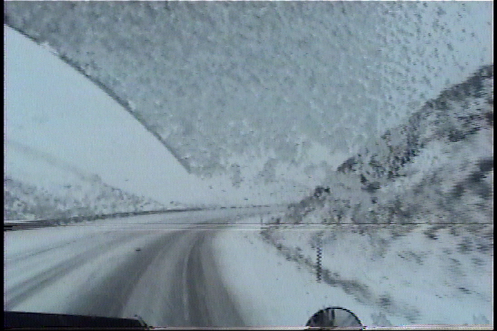

# video-scanner
Contains tools for scanning video files for information in conjunction with Avisynth and VirtualDub workflows.

## Initial setup

Create and activate a Python virtual environment.  For example, on Windows from the Command Prompt:

```
<path_to>\python.exe -m venv .\.venv
.\Scripts\activate.bat
```

Next, install the requirements:

```
pip install -r requirements.txt
```

Note that you must also ensure that FFmpeg is in your PATH, if it is not already.

You can now run the scripts in this repository.

## analyze_virtualdub_timing_log

When capturing AVI files, VirtualDub can create a timing log.  This script flags any video and audio frames that have particularly anomalous timestamps.  These locations in the AVI file can then be manually examined in more detail.

To use this script:

1.  Before capturing an AVI file in VirtualDub, click the **Capture** menu, and then toggle on **Enable timing log**.
2.  Start the capture as normal.
3.  When the capture finishes, VirtualDub will ask you to save the CSV file for the timing log.
4.  Run the `analyze_virtualdub_timing_log.py` script, using this timing log as input.  You will also need to provide the exact frame rate of the AVI file as input.  The following example applies for NTSC 29.970 frame rates:

	```
	python analyze_virtualdub_timing_log.py --fps-num 30000 --fps-den 1001 MyTimings.csv
	```

5.  The script will print out all video and audio frames that have timings that look a little too far off.  Carefully check the video at and around these global time positions for:
    - Null/drop video frames (i.e. inserted/repeated frames).
    - Incorrect audio/video sync.
    - Unexpected video frame data.
    - Audio distortion.

## dv_resample_audio

[dv_resample_audio](src/dv_resample_audio/README.md) resamples DV audio so that it is locked to the video frames that it was interleaved with.  This corrects audio drift that is present from unlocked DV cameras, such as consumer camcorders.

## top_line_errors

This tool is intended for use with identifying occasional bad frames that have severe errors within a single horizontal line.  For example, this could be a severe VHS dropout that spans several lines.

The usage of this tool is best illustrated with an example.  Suppose that a video contains a single frame with an artifact like this:



The [SpotLess](https://forum.doom9.org/showthread.php?t=181777) Avisynth filter can work reasonably well to remove this artifact.  However, it will also remove detail from other parts of the frame as well.  This implies that frames with no defects will also be impacted.  For example, fireworks, camera flashes, flying balls, etc. are all negatively impacted by this filter.

We can use this tool in conjunction with Avisynth to only apply the SpotLess filter to frames that actually need it.  Other frames will be passed through unmodified.

First, you must output each field in an interlaced video into their own respective videos.  This is inspired by [this post](https://forum.doom9.org/showthread.php?p=1932874#post1932874) on Doom9.  The following Avisynth fragment can help accomplish this:

```
# Always crop the borders to remove any errors that regularly occur there, such as from head switching noise.
Crop(10, 4, -10, -8)

# Process even frames:
original = SeparateFields.SelectEven
# Example filter for removing the artifacts
filtered = original.SpotLess(tm=false, ThSAD=2000)
# "difference" will call abs on the difference, unlike the Subtract filter.
diff = Overlay(original, filtered, mode="difference")
diff
# Uncomment this for debugging.  Note that this stacked debug output is not compatible with top_line_errors:
# StackVertical(original, filtered, diff)

# <NOT SHOWN: Repeat the above process using SelectOdd>
```

The rendered output will contain the difference between the input frame and the filtered/denoised frame.  Render this output to a LOSSLESS video file supported by FFmpeg.  For example, FFV1 in an mkv container works well.


Next, run the top_line_errors script to analyze each output video that you rendered:

```
# NOTE: the script provides default values for many parameters
python top_line_errors.py diff_even.mkv --frame-error-function find-dropouts --output-avisynth bad_frames_even.txt
```

The script works as follows for each frame if using the `find-dropouts` error function:

1.  The frame is converted to RGB if it is not already.
2.  All pixel channels are averaged into a single value.
3.  A 1D averaging filter is individually applied to each horizontal line.  A large filter kernel is used to emphasize the fact we're looking for long lines, as seen in a dropout.
4.  The lines are then filtered to search for very bright line segments, which are considered to be dropouts.  This is done by looking for any averaged pixel in the line that exceeds a threshold.  If none are found in the frame, then the frame is not outputted.
5.  Each averaged line is also searched for pixels exceeding a lower "change" threshold.  This doesn't necessarily mean there is a dropout.  We're just generally searching for lines that have any sort of significant changes.  If too many lines are found, then the frame is not outputted because it's likely to be a false positive otherwise (e.g. camera flashes, fireworks explosions).
6.  All averaged pixel values for each remaining horizontal line are in turn averaged again, so that each line is aggregated into a single error value.
7.  At this point, we have a simple one-dimensional list of average pixel error for each remaining line.  This list is sorted in descending order.  (If you'd like to see this intermediate list, look into the `--debug-frame` argument.)
8.  The top-most erroneous lines are chosen.  The error values for each of these lines are then averaged together into a single error value for the entire frame.

This results in a simple list of a single error value for each frame.  These are then further filtered using the `--frame-threshold` parameter.

Note that there is also a `mean` value for `--frame-error-function` that simply calculates the overall mean of each frame before they are filtered.  This is useful if looking for frames with large errors and we aren't specifically looking for horizontal dropouts.

The output contains a list of frames that exceed the `--frame-threshold` frame error:

```
# Bad frame numbers for use with Avisynth ConditionalReader
TYPE bool
DEFAULT false

# frame 469 error: 176.0795238095238
469 true

# frame 1776 error: 163.54142857142858
1776 true
```

At this point, you can uncomment the `StackVertical` line in the original Avisynth script.  Examine each frame number and ensure it's a bad frame you want to apply filtering to.  If you don't want to apply filtering (e.g. it's not a bad frame), then delete the frame number entirely from the output.  You might also use this as an opportunity to tune the parameters to your filter (e.g. SpotLess), and then optionally repeat this entire process.

The resulting text files can be used with the [ConditionalReader](http://avisynth.nl/index.php/ConditionalReader) and [ConditionalFilter](http://avisynth.nl/index.php/ConditionalFilter) filters in Avisynth to apply filtering to only the bad frames when generating a final output:

```
function fix_bad_frames(clip original, string badFrameFile) {
    filtered = original.SpotLess(tm=false, ThSAD=2000)
    ConditionalFilter(original, filtered, original, "bad_frame", "==", "True", true).ConditionalReader(badFrameFile, "bad_frame", true)
}

even = SeparateFields.SelectEven.fix_bad_frames("bad_frames_even.txt")
odd = SeparateFields.SelectOdd.fix_bad_frames("bad_frames_odd.txt")
Interleave(even, odd).Weave
```

## dv_merge

Experimental tool for merging raw DV video files.  This is a simple tool with some key input requirements:

- The files must be of the same length (same exact file size).
- Corresponding frames must have the same frame number / byte offset in every input file.

Based on these requirements, the tool can be more resilient to DV timecode errors that might challenge an alternative algorithm that tries to match corresponding frames using DV timecodes.  Instead, it simply assumes that corresponding frames are at the same position.  The output file is guaranteed to have the exact same frame count as all the input files.

The tool has two merge algorithms that can be specified with the `--merge-algorithm` argument:

- `analysis`: Runs both DV Analyzer and DVRescue analysis tools against the inputs.  The output frame is chosen from an input that has no analysis errors from either tool, if possible.  If only one tool reported an issue, preference is given to clean DVRescue results.
- `binary`: A very simplistic n-way binary merge of the inputs.  The most common byte at each byte position is selected in the output.  This will result in the output raw frame data being a blend of the inputs.  Note that since I don't have a copy of the DV specifications, it's unclear how safe this really is.  It's possible it could result in something that other decoders might struggle with.
